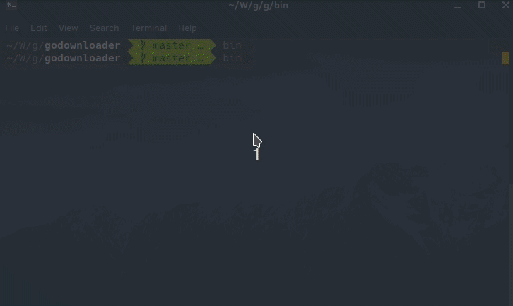

# GoDownloader

A multipart, resumable, multithread downloader



## Usage

```
Usage of godownloader:
  -o string
        output path
  -u string
        the url to download
  -w int
        worker to download (default 6)
```


```sh
go install
godownloader -u https://cdn.changelog.com/uploads/gotime/81/go-time-81.mp3 -o ./go-time-81.mp3
```

If there has any interrupt, just run again, application will use the cached files and continue download unfinish part

## Flow

1. fetch size and rangeable
2. if rangeable
        2.1 if not: download file directly. **out**
3. split into serval chunk
        3.1. Chunk{path: size:}
4. launch workers
5. send chunk to workers
6. worker get chunk, start download
        6.1 check file exist or not and checksum
        6.2 if file already download return finish chunck
        6.3 if not, start download

7. finish chunck == split chunck; merge all chunk into one
